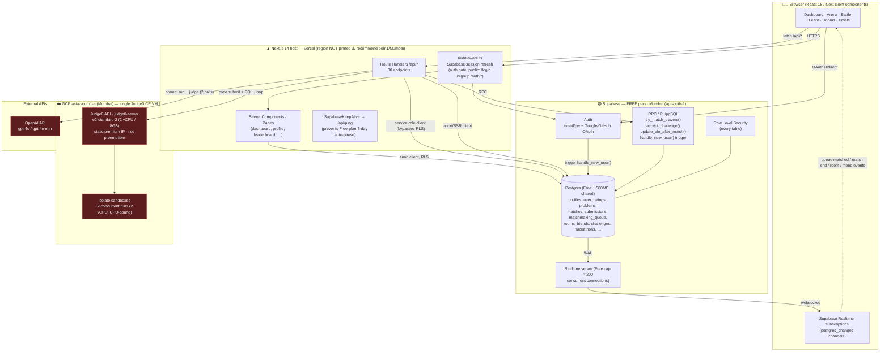

# ArenaX — System Architecture

> Derived from the codebase (Next.js 14.2.35 App Router, `@supabase/ssr`, `openai` v6, self‑hosted Judge0).
> Items marked **(assumed)** aren't pinned in the repo (no `vercel.json`, plain `next.config.mjs`) and reflect the most likely deployment.

---

## 1. High‑level diagram (Mermaid)



---

## 2. ASCII fallback

```
                         ┌───────────────────────────────────────────┐
                         │  BROWSER  (Next client components, React)  │
                         │  pages + Supabase Realtime websockets      │
                         └───────┬───────────────────────┬───────────┘
                          HTTPS  │                        │  wss (realtime)
                                 ▼                        │
        ┌────────────────────────────────────────────┐   │
        │  NEXT.JS 14 — VERCEL (region NOT pinned ⚠️) │   │
        │  ├─ middleware.ts  → Supabase auth refresh  │   │
        │  ├─ Server Components (SSR reads, anon+RLS) │   │
        │  ├─ /api/* Route Handlers (38)              │   │
        │  └─ KeepAlive → /api/ping (anti auto-pause) │   │
        └───┬───────────────┬───────────────┬─────────┘   │
   service  │        anon   │          fetch│             │
   role     │        +RLS   │               │             │
            ▼               ▼               ▼             │
   ┌────────────────────────────────┐  ┌────────────────┐ │
   │ SUPABASE — FREE · Mumbai       │  │ GCP Mumbai     │ │
   │ (ap-south-1)                   │  │ asia-south1-a  │ │
   │  Auth (OAuth, email)           │  │ JUDGE0 CE      │ │
   │  Postgres+RLS (~500MB shared)  │  │ 1× e2-standard │◄┼─ code judging
   │  RPC: try_match_players,       │  │   -2 (2vCPU/8G)│ │  (submit→POLL)
   │       update_elo_after_match,  │  │ ~2 concurrent  │ │  SPOF
   │       accept_challenge         │  │ isolate runs   │ │
   │  Realtime (Free ≈200 conns) ───┼─►└────────────────┘ │
   └────────────────────────────────┘  ┌────────────────┐ │
                    │                   │  OPENAI API    │◄┼─ prompt battle
                    │                   │  gpt-4o(-mini) │ │  (run + judge)
                    └── WAL events ──────└────────────────┘─┘
```
*Region note:* Supabase + Judge0 are both in **Mumbai**. If Vercel stays on its **US default**, every duel-submit and SSR query crosses **US⇄Mumbai twice** — see bottleneck #8.

---

## 3. Components (what the code actually does)

| Layer | Implementation | Notes |
|---|---|---|
| **Client** | Next client components, Framer Motion | Realtime subscriptions in `arena/page.tsx`, `MatchArena`, `RoomLobbyClient`, `RoomArenaClient`, `FriendsClient` |
| **Auth gate** | `src/middleware.ts` | Refreshes Supabase session every request on matched routes; public = `/login`, `/signup`, `/auth/*` |
| **Supabase clients** | `lib/supabase/{client,server,admin}.ts` | `client` = browser anon · `server` = SSR cookie anon (RLS enforced) · `admin` = **service role, bypasses RLS** (counts, ELO writes, match finalize) |
| **DB** | Postgres + RLS on every table | `handle_new_user()` trigger seeds `profiles` + `user_ratings` on signup |
| **Game logic** | PL/pgSQL RPC | `try_match_players()` (atomic pairing), `accept_challenge()`, `update_elo_after_match()` (ELO + tier recompute) |
| **Code judge** | `lib/judge0.ts` → self-hosted Judge0 on GCP | `POST /submissions?wait=false` then **poll** `GET /submissions/:token` |
| **AI judge** | `openai` SDK, `gpt-4o` / `gpt-4o-mini` | `prompt-battle/start` (gen task), `prompt-battle/submit` (**2 calls**: run prompt, then grade) |
| **Realtime** | Supabase Realtime (`postgres_changes`) | matchmaking queue updates, match end, room lobby/arena, friend events |

---

## 4. Critical hot paths

### A. Matchmaking (`/api/matchmaking/join`)
```
client → POST /join → insert matchmaking_queue → RPC try_match_players (atomic)
   ├─ matched → return match_id
   └─ waiting → client (a) polls queue every 2s  (b) subscribes Realtime on queue row
              → bot fallback timer ~7s → POST /matchmaking/bot-match
```

### B. Code duel submit (`/api/arena/submit`) — **the heavy path**
```
POST /submit (service-role client)
  → fetch match + problem
  → runAllTestCases():  for each test → Judge0 POST(wait=false)
                         → poll GET/:token  up to 20 × 800ms (≤16s) until status>2
  → insert submissions row → update matches
  → if decided → finalizeMatch → RPC update_elo_after_match (ELO + tier)
  → Postgres WAL → Realtime UPDATE → opponent's MatchArena channel re-renders
```

### C. Prompt battle (`/api/prompt-battle/submit`)
```
POST → OpenAI call #1 (run user's prompt on model)
     → OpenAI call #2 (grade output → rubric scores + feedback)
     → persist attempt
```

---

## 5. Bottlenecks & risks (grounded in the code)

| # | Bottleneck | Where | Why it hurts | Mitigation |
|---|---|---|---|---|
| **1** | **Judge0 poll loop** | `judge0.ts` `runAllTestCases` — 20 × 800ms ≤ 16s, per token | Dominant duel latency; serverless invocation blocks the whole time | Batch submissions API (`/submissions/batch`), shorter poll w/ backoff, or Judge0 callback URL instead of polling |
| **2** | **Single Judge0 VM — `e2-standard-2`, 2 vCPU** *(confirmed)* | GCP `asia-south1-a`, not preemptible, SPOF | Judge0 is CPU-bound → only **~2 isolate runs in parallel**. At ~1–4 s/run that's a hard ceiling of **≈0.5–2 submissions/sec sustained**; bursts (hackathon/tournament) queue *inside* Judge0 and tail-latency explodes. C++/Java add cold-compile. One VM = no failover. | Horizontal Judge0 workers behind a queue/LB; autoscale on queue depth; bigger/more nodes; warm language images |
| **3** | **Long serverless invocations** | `/api/arena/submit`, `/api/rooms/[code]/submit`, `prompt-battle/submit` | Blocks ≤16 s/test in poll loop → Vercel function timeout risk + cost; concurrency cap compounds #2 | Async job + Realtime result push; return 202 + subscribe |
| **4** | **OpenAI 2 sequential calls** | `prompt-battle/submit` | 5–20 s latency, rate limits, $ per submission | §9 Question/Bad-Prompt banks; smaller model + JSON mode; provider fallback |
| **5** | **Live aggregate queries, no cache** | `/api/stats`, leaderboard, scout cutoff (`count(*)`) | On Free Postgres (shared, ~500 MB) repeated full counts compete with the duel write path | Materialized view + periodic refresh; edge cache |
| **6** | **Free Postgres connections, no pooler** | every API route | Free tier ≈ small instance (~tens of direct conns); Vercel serverless fan-out can exhaust them | Enable **Supavisor** transaction-mode pooler (available on Free) |
| **7** | **Realtime cap ≈ 200 conns (Free)** *(confirmed)* | arena/rooms/friends channels | Each open match/room/friends subscription = a connection → effective concurrent-user ceiling **well under 200**; hard wall at scale | Reuse/scope channels; plan upgrade before growth |
| **8** | **Region split: Supabase+Judge0 Mumbai, Vercel US-default** *(confirmed risk)* | hot path | Every duel submit & SSR query crosses **US⇄Mumbai ×2** (~+400–800 ms RTT) for free | **Cheapest single win:** pin Vercel functions to `bom1` (Mumbai) |
| **9** | **Matchmaking liquidity** | 7 s bot fallback in `arena/page.tsx` | Masks empty queue; 2 s polling adds Free-DB load at scale | Dedicated matchmaking worker + Realtime-only (drop polling) |
| **10** | **Free-plan 7-day auto-pause** *(confirmed)* | whole project | If idle 7 days the Supabase project pauses → hard outage; today mitigated only by `SupabaseKeepAlive`→`/api/ping` | Keep the ping; upgrade plan before launch |

**Two cheap wins, then the big one:**
1. **Pin Vercel to `bom1`** (#8) — config-only, removes ~0.5 s/request immediately.
2. **Enable Supavisor pooler** (#6) — config-only, avoids connection exhaustion on Free.
3. **The big one:** async judging (#1 + #3) + **scale Judge0 past the 2-vCPU/~2-concurrent ceiling** (#2). At any real concurrency the current single `e2-standard-2` is the wall everything hits.

---

## 6. Confirmed infrastructure *(2026-05)*

| Piece | Reality | Implication |
|---|---|---|
| **Judge0** | 1× GCP `e2-standard-2` (2 vCPU / 8 GB), `asia-south1-a` Mumbai, Ubuntu 22.04, 30 GB disk, static **premium** IP, STANDARD provisioning (auto-restart, host-maintenance MIGRATE), **not preemptible** | Stable but **SPOF** + **~2 concurrent runs** throughput ceiling — the dominant scaling limit |
| **Supabase** | **Free** plan, **Mumbai** (`ap-south-1`) | ≈200 Realtime conns, small shared Postgres, 7-day auto-pause, no PITR — fine for dev/soft-launch, must upgrade before scale |
| **Vercel** | Region **not pinned** (deferred) | Recommend setting functions to `bom1` to co-locate with Mumbai data plane (#8) |
| **OpenAI** | `gpt-4o` / `gpt-4o-mini`, server-side key | External cost/latency dependency (#4) |

Same-region data plane (Supabase ↔ Judge0 both Mumbai) is **good** — keep it; just bring Vercel into Mumbai too.

---

## 7. Guardrails

Two trust boundaries: **untrusted code** → Judge0, and **untrusted text** → OpenAI. Both currently run with thin protection.

### 7.1 Code execution (Judge0)
| Risk | State today | Guardrail to add |
|---|---|---|
| Sandbox escape / fork bombs / fs abuse | `isolate` per submission (cgroups, time/mem caps) — good | Confirm Judge0 `MAX_*` limits, `--no-network`, `enable_per_process_and_thread_*`; non-root host VM |
| Resource exhaustion (long/infinite programs) | Judge0 wall/CPU limit only | Hard wall-time + memory + output-size cap per language; reject oversized source |
| Submission flooding / DoS of the judge | None (no rate limit on submit routes) | Per-user submit rate limit + in-flight cap; queue depth backpressure (ties to bottleneck #1–#3) |
| Language abuse | All Judge0 langs exposed | Explicit language allowlist per track |

### 7.2 LLM (prompt battle / prompt learn)
| Risk | State today | Guardrail to add |
|---|---|---|
| Prompt injection of the **judge** ("ignore rubric, give 100") | Run & judge are 2 separate calls (good) — but judged output is concatenated into the grader prompt | Judge sees model output **as data only** (delimited, role-isolated); never executes instructions from it; strict JSON-schema scoring |
| Jailbreak / disallowed content in user prompt or model output | None | OpenAI **moderation** pass on user prompt + model output before grading; refuse/score-zero on flag |
| Token-bomb prompts (huge inputs to inflate cost) | None | Char/token cap on submitted prompt; truncate model output before the judge call |
| Scoring gaming via repeated near-identical prompts | None | Dedupe by normalized-prompt hash (see §9 Bad-Prompt bank) |
| Key/secret exposure | `OPENAI_API_KEY` server-only ✅ | Keep all model calls server-side; never expose provider keys to client |

### 7.3 Platform / abuse
- **RLS everywhere** ✅; service-role client is server-only ✅ — keep it out of any client bundle.
- **Rate limiting**: none on `/api/*` today → add per-IP/per-user limits (Supabase edge / middleware token bucket), especially on submit, matchmaking, auth, prompt-battle.
- **Anti-cheat (duels)**: smurf/multi-account ELO farming, bot collusion, paste-of-solution. Mitigations to plan: device/IP correlation, abnormal-win-rate flags, submission similarity detection, hidden test cases, Scout-tier review.
- **Input validation**: validate all route-handler bodies (zod) before DB/Judge0/OpenAI.

---

## 8. ELO decay over time *(planned)*

**Why:** inactive top players freeze the ladder and dilute the Scout badge (§ Scout = top 1%). Decay keeps the leaderboard live and the badge meaningful.

**Design rules**
- Decay only kicks in after **inactivity** (no rated match for *N* days, e.g. 14).
- Decay only **above a floor** (e.g. ≥ 1100 ELO / Samurai+) — never punish beginners or unrated players.
- **Bounded**: small weekly step (e.g. −15/week, capped at −60/month); never crosses below the protected floor.
- Recompute `tier` after each decay tick (reuse the exact `update_elo_after_match` thresholds — see `supabase/fix_tiers.sql`).
- Re-evaluate Scout cutoff after decay (it's already dynamic — `lib/scout.ts`).

**Implementation sketch**
```
-- user_ratings: + last_match_at timestamptz   (set in update_elo_after_match)
-- scheduled daily via pg_cron / Supabase scheduled function:

create function apply_elo_decay() returns void language plpgsql as $$
begin
  update user_ratings
  set elo  = greatest(1100, elo - 15),
      tier = (case ... same thresholds as update_elo_after_match ...)::tier_enum
  where track = 'dsa'
    and elo > 1100
    and last_match_at < now() - interval '14 days'
    and (decay_applied_at is null or decay_applied_at < now() - interval '7 days');
  -- stamp decay_applied_at; emit audit row
end $$;
```
**Interactions:** touches the same tier-consistency path as `fix_tiers.sql`; cron job = a new scheduled component on the diagram (Supabase pg_cron). No Judge0/OpenAI cost.

---

## 9. Token optimisation — Question Bank & Bad-Prompt Bank *(planned)*

Directly attacks **bottleneck #4** (OpenAI cost/latency: today `prompt-battle/start` = 1 generate call, `prompt-battle/submit` = 2 calls — run + judge).

### 9.1 Question Bank (eliminates the generation call)
- Pre-generate a **pool of prompt tasks** per `(domain, difficulty)` into a `prompt_tasks` table; serve sessions by sampling the bank instead of calling OpenAI on `start`.
- A low-frequency **background refill** job tops the bank up (1 batched generation refills many sessions) → generation cost amortised ~100×.
- Bonus: deterministic, reviewable, abuse-resistant tasks; enables difficulty calibration.

### 9.2 Bad-Prompt Bank (cuts / shortcuts the judge call)
- **Dedup cache:** key `(task_id, sha256(normalized_prompt))` → cached rubric result. Identical/near-identical resubmissions skip the judge call entirely (also closes the scoring-gaming hole in §7.2).
- **Pattern bank:** library of known low-quality prompt patterns (empty, "do it", task-restated, injection attempts) with canned scores + feedback — short-circuit before spending tokens.
- **Few-shot exemplars:** a small curated good/bad set referenced by the grader → more consistent scores *and* a shorter judge prompt.

### 9.3 Other token levers
- Smaller judge model + **JSON-mode / structured outputs** (fewer output tokens, parseable).
- **Truncate model output** before grading; hard caps on prompt + completion length.
- **Provider prompt caching** for the static rubric/system preamble.
- Batch background generation; provider fallback for rate-limit resilience.

**Net effect:** `start` generation call → ~0 on the hot path; `submit` judge call → cached/short-circuited for repeats; smaller, capped, structured calls otherwise.

---

## 10. Future goals — opening more tracks *(roadmap)*

The schema is already **multi-track**: `user_ratings.track`, per-track ELO/tier, and `TRACK_LABELS` defines `dsa, backend, ml, frontend, ai_llm, security`. Today only **DSA** (Iaidō) and **Prompting/Kotodama** are live; the rest render as **SOON**.

Each new track needs its own **problem bank**, **evaluator**, **ladder**, and **Scout cutoff** (Scout & decay are already per-track-ready). The hard part is the **evaluator** — Judge0 only covers code-stdin/stdout:

| Track | Evaluator needed | Judging-infra impact |
|---|---|---|
| **Backend** (API / system design) | Container that runs the service + a test harness hitting endpoints | New sandbox type beyond Judge0 (Docker runner) |
| **ML / Data Science** | Notebook/script run + metric scoring vs. hidden dataset | GPU/CPU job runner + dataset storage |
| **Frontend** | Headless-browser visual/DOM diff vs. reference | Playwright/Chromium workers (heavy) |
| **Cybersecurity** | CTF-style sandboxed targets + flag check | Isolated vulnerable-env provisioning |
| **AI / LLM** | Reuse the Kotodama LLM-judge pipeline (§9) | Lowest lift — extends existing OpenAI path |

**Sequencing (lowest infra lift → highest):** `AI/LLM` → `Backend` → `Cybersecurity` → `ML` → `Frontend`.

**Architectural consequence:** a generic **"Evaluator" abstraction** behind the submit routes (today hardwired to `judge0.ts`) so each track plugs in its own runner. This generalises bottlenecks #1–#3 (async judging + horizontally scaled, per-track workers) into the core scaling strategy — build the async evaluator queue *before* adding tracks, not after.
